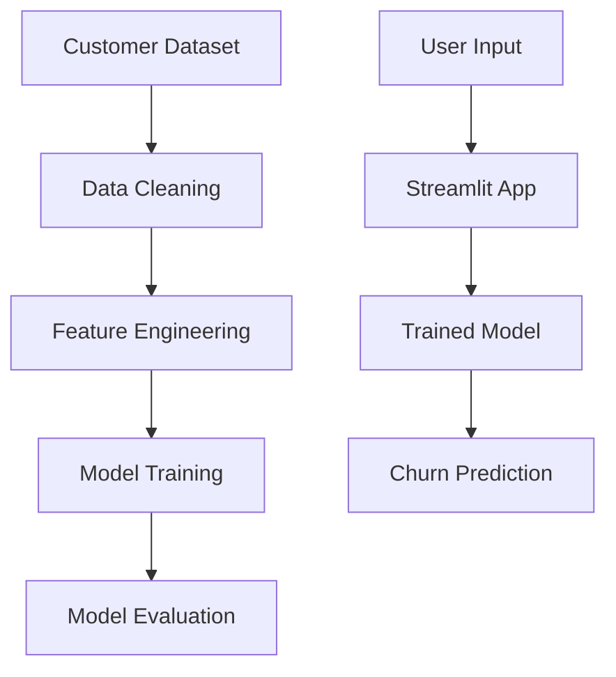

# customer-churn-prediction

Machine learning system for predicting telecom customer churn using supervised learning models and customer behavior analysis.

---

# Overview

This project demonstrates a practical machine learning workflow for customer churn prediction using data preprocessing, feature engineering, model training, evaluation, and deployment workflows.

The system analyzes customer behavior patterns and predicts the probability of churn using classification models.

The project focuses on practical ML engineering concepts including model evaluation, backend integration, reproducibility, and business-oriented decision making.

---

# Key Features

- Data preprocessing pipeline
- Feature engineering workflow
- Exploratory data analysis
- Supervised machine learning models
- Model evaluation metrics
- Class imbalance handling
- Threshold tuning workflow
- Confusion matrix analysis
- Streamlit prediction interface
- Modular project structure

---

# Tech Stack

## Machine Learning
- Scikit-learn
- Pandas
- NumPy

## Backend / Interface
- Python
- Streamlit

---

# Architecture




---

# Dataset

- Kaggle Telco Customer Churn Dataset
- 7,043 customer records
- 21 features

---

# Model Evaluation

| Metric | Score |
|--------|------|
| Accuracy | 0.76 |
| F1 Score | 0.60 |
| Recall | 0.66 |
| ROC-AUC | 0.81 |
| Cross-validation F1 | 0.587 |

### Best Model

Random Forest (`class_weight="balanced"`)

---

# Business Insight

Missing churners is more costly than false alarms.

- False Negative → lost customer revenue
- False Positive → additional retention effort

The model is optimized for recall to reduce customer churn risk.

---

# Confusion Matrix Analysis

## Random Forest

- True Negatives: 828
- False Positives: 207
- False Negatives: 125
- True Positives: 249

---

# Model Evaluation Visuals

## Random Forest


## Decision Tree


## Logistic Regression


---

# What I Built

- Data cleaning and preprocessing
- Feature engineering workflow
- Feature selection using Random Forest importance
- Compared Logistic Regression, Decision Tree, and Random Forest
- Handled class imbalance using `class_weight`
- Threshold tuning for business trade-offs
- Confusion matrix evaluation
- Cross-validation workflow
- Streamlit interface for predictions

---

# Local Development

## Install Dependencies

```bash
pip install -r requirements.txt
```

## Run Training Script

```bash
python churn_model.py
```

## Run Streamlit App

```bash
streamlit run app.py
```

---

# Future Improvements

- Hyperparameter tuning
- Model monitoring
- Explainable AI integration
- FastAPI backend integration
- Docker deployment
- CI/CD workflows
- Cloud deployment
